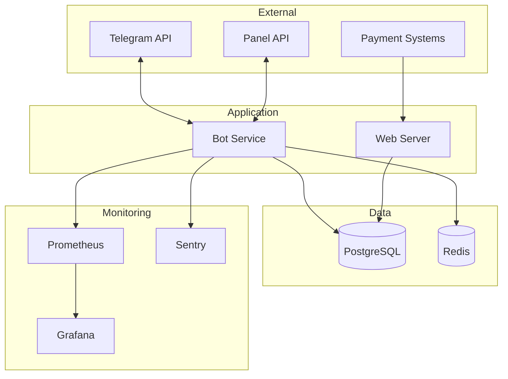

# Документация 2GETPRO v2

Добро пожаловать в документацию проекта 2GETPRO v2 - улучшенной версии Telegram-бота для управления VPN подписками.

## 📚 Разделы документации

### 🔌 [API Документация](./api/)

Полное описание API, webhook endpoints и сервисов:

- **[API Overview](./api/README.md)** - Обзор API, аутентификация, форматы данных
- **[Webhooks](./api/webhooks.md)** - Документация webhook'ов для всех платежных систем
- **[Services](./api/services.md)** - Подробное описание всех сервисов приложения

**Основные темы:**
- Webhook endpoints (YooKassa, CryptoPay, FreeKassa, Tribute, Stars, Panel)
- Валидация подписей
- Обработка платежей
- Сервисы (Balance, Subscription, Payment, Referral, PromoCode)

### 🚀 [Руководство по развертыванию](./deployment/)

Инструкции по развертыванию в различных окружениях:

- **[Deployment Overview](./deployment/README.md)** - Обзор вариантов развертывания
- **[Docker Deployment](./deployment/docker.md)** - Развертывание через Docker Compose
- **[Kubernetes Deployment](./deployment/kubernetes.md)** - Развертывание в Kubernetes
- **[Production Checklist](./deployment/production.md)** - Чеклист для продакшн

**Основные темы:**
- Требования к системе
- Конфигурация окружения
- SSL/TLS сертификаты
- Настройка webhook'ов
- Мониторинг и логирование

### ⚙️ [Операционное руководство](./operations/)

Ежедневные операционные задачи и процедуры:

- **[Operations Overview](./operations/README.md)** - Обзор операционных задач
- **[Troubleshooting](./operations/troubleshooting.md)** - Решение типичных проблем

**Основные темы:**
- Ежедневные/еженедельные/ежемесячные задачи
- Мониторинг и алерты
- Резервное копирование
- Управление базой данных
- Диагностика проблем

### 👨‍💻 [Руководство разработчика](./development/)

Информация для разработчиков проекта:

- **[Development Guide](./development/README.md)** - Начало работы, стандарты кода, тестирование

**Основные темы:**
- Настройка окружения разработки
- Структура проекта
- Стандарты кода (PEP 8, type hints)
- Написание тестов
- Git workflow
- Code review guidelines

## 🎯 Быстрый старт

### Для новых пользователей

1. Прочитайте [Deployment Overview](./deployment/README.md)
2. Следуйте [Docker Deployment Guide](./deployment/docker.md)
3. Проверьте [Production Checklist](./deployment/production.md)

### Для разработчиков

1. Прочитайте [Development Guide](./development/README.md)
2. Настройте окружение разработки
3. Изучите [API Documentation](./api/)

### Для операторов

1. Изучите [Operations Guide](./operations/README.md)
2. Ознакомьтесь с [Troubleshooting Guide](./operations/troubleshooting.md)
3. Настройте мониторинг

## 📖 Структура документации

```
docs/
├── README.md                    # Этот файл
├── api/                         # API документация
│   ├── README.md               # Обзор API
│   ├── webhooks.md             # Webhook endpoints
│   └── services.md             # Сервисы приложения
├── deployment/                  # Развертывание
│   ├── README.md               # Обзор развертывания
│   ├── docker.md               # Docker Compose
│   ├── kubernetes.md           # Kubernetes
│   └── production.md           # Production checklist
├── operations/                  # Операции
│   ├── README.md               # Операционные задачи
│   └── troubleshooting.md      # Решение проблем
└── development/                 # Разработка
    └── README.md               # Руководство разработчика
```

## 🔍 Поиск информации

### По задачам

**Развертывание нового инстанса:**
1. [Deployment Overview](./deployment/README.md)
2. [Docker Deployment](./deployment/docker.md)
3. [Production Checklist](./deployment/production.md)

**Настройка платежной системы:**
1. [Webhooks Documentation](./api/webhooks.md)
2. [Services Documentation](./api/services.md)

**Решение проблемы:**
1. [Troubleshooting Guide](./operations/troubleshooting.md)
2. [Operations Guide](./operations/README.md)

**Добавление новой функции:**
1. [Development Guide](./development/README.md)
2. [API Documentation](./api/)

### По компонентам

**База данных:**
- [Operations Guide](./operations/README.md) - Управление БД
- [Troubleshooting](./operations/troubleshooting.md) - Проблемы с БД

**Платежи:**
- [Webhooks](./api/webhooks.md) - Webhook endpoints
- [Services](./api/services.md) - Payment services
- [Troubleshooting](./operations/troubleshooting.md) - Проблемы с платежами

**Мониторинг:**
- [Deployment](./deployment/README.md) - Настройка мониторинга
- [Operations](./operations/README.md) - Ежедневный мониторинг

## 🛠️ Технологический стек

- **Python 3.11+** - Основной язык
- **aiogram 3.x** - Telegram Bot Framework
- **PostgreSQL 15+** - База данных
- **Redis 7+** - Кэширование
- **SQLAlchemy 2.0** - ORM
- **Alembic** - Миграции БД
- **Docker** - Контейнеризация
- **Prometheus** - Метрики
- **Grafana** - Визуализация
- **Sentry** - Отслеживание ошибок

## 📊 Архитектура



## 🔗 Полезные ссылки

### Внешние ресурсы

- [aiogram Documentation](https://docs.aiogram.dev/)
- [SQLAlchemy Documentation](https://docs.sqlalchemy.org/)
- [PostgreSQL Documentation](https://www.postgresql.org/docs/)
- [Docker Documentation](https://docs.docker.com/)
- [Kubernetes Documentation](https://kubernetes.io/docs/)

### Проект

- [GitHub Repository](https://github.com/your-repo/2GETPRO_v2)
- [Issue Tracker](https://github.com/your-repo/2GETPRO_v2/issues)
- [Changelog](../CHANGELOG.md)

## 📝 Вклад в документацию

Документация - живой проект. Если вы нашли ошибку или хотите улучшить документацию:

1. Создайте Issue с описанием проблемы
2. Или создайте Pull Request с исправлениями
3. Следуйте стилю существующей документации

### Стиль документации

- Используйте Markdown
- Добавляйте примеры кода
- Используйте диаграммы Mermaid для визуализации
- Пишите на русском языке
- Будьте конкретны и практичны

## 🆘 Получение помощи

Если вы не нашли ответ в документации:

1. Проверьте [Troubleshooting Guide](./operations/troubleshooting.md)
2. Поищите в [GitHub Issues](https://github.com/your-repo/2GETPRO_v2/issues)
3. Создайте новый Issue с подробным описанием проблемы
4. Свяжитесь с командой разработки

## 📄 Лицензия

Этот проект лицензирован под MIT License - см. файл [LICENSE](../LICENSE) для деталей.

---

**Последнее обновление:** 2024-01-27

**Версия документации:** 2.0.0

**Версия проекта:** 2.0.0