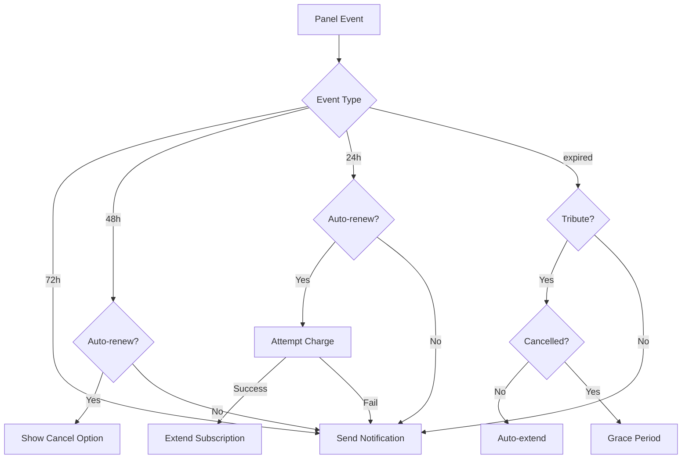

# Webhook Документация

## Обзор

Webhook'и используются для получения уведомлений о событиях от платежных систем и панели управления в реальном времени.

## Содержание

- [YooKassa Webhook](#yookassa-webhook)
- [CryptoPay Webhook](#cryptopay-webhook)
- [FreeKassa Webhook](#freekassa-webhook)
- [Tribute Webhook](#tribute-webhook)
- [Stars Webhook](#stars-webhook)
- [Panel Webhook](#panel-webhook)

---

## YooKassa Webhook

### Endpoint

```
POST /webhook/yookassa
```

### Конфигурация

```env
YOOKASSA_SHOP_ID=your_shop_id
YOOKASSA_SECRET_KEY=your_secret_key
WEBHOOK_BASE_URL=https://your-domain.com
```

### Формат запроса

YooKassa отправляет POST запрос с JSON телом:

```json
{
  "type": "notification",
  "event": "payment.succeeded",
  "object": {
    "id": "2d8f0e8d-000f-5000-8000-18db351245c7",
    "status": "succeeded",
    "paid": true,
    "amount": {
      "value": "100.00",
      "currency": "RUB"
    },
    "metadata": {
      "user_id": "123456",
      "subscription_months": "1"
    },
    "payment_method": {
      "type": "bank_card",
      "id": "2d8f0e8d-000f-5000-8000-18db351245c7",
      "saved": true,
      "card": {
        "last4": "4444",
        "card_type": "MasterCard"
      }
    }
  }
}
```

### Валидация

YooKassa использует IP whitelist и встроенную валидацию SDK.

### Обработка событий

#### payment.succeeded

Успешный платеж:

1. Обновление статуса платежа в БД
2. Активация подписки
3. Применение реферальных бонусов
4. Сохранение платежного метода (если `save_payment_method=true`)
5. Отправка уведомления пользователю

#### payment.canceled

Отмененный платеж:

1. Обновление статуса в БД
2. Логирование события

### Пример ответа

```json
{
  "status": "success"
}
```

### Коды ошибок

| Код | Описание |
|-----|----------|
| 400 | Неверный формат данных |
| 403 | Неверная подпись |
| 404 | Платеж не найден |
| 500 | Внутренняя ошибка |

---

## CryptoPay Webhook

### Endpoint

```
POST /webhook/cryptopay
```

### Конфигурация

```env
CRYPTOPAY_TOKEN=your_token
CRYPTOPAY_NETWORK=mainnet  # или testnet
CRYPTOPAY_CURRENCY_TYPE=fiat  # или crypto
CRYPTOPAY_ASSET=RUB
```

### Формат запроса

```json
{
  "update_id": 123456,
  "update_type": "invoice_paid",
  "request_date": "2024-01-01T12:00:00Z",
  "payload": {
    "invoice_id": 12345,
    "status": "paid",
    "amount": "100.00",
    "asset": "RUB",
    "payload": "{\"user_id\":\"123456\",\"subscription_months\":\"1\",\"payment_db_id\":\"789\"}"
  }
}
```

### Валидация

Автоматическая валидация через aiocryptopay SDK.

### Обработка

1. Парсинг payload
2. Обновление статуса платежа
3. Активация подписки
4. Применение реферальных бонусов
5. Уведомление пользователя

### Пример ответа

```
HTTP 200 OK
```

---

## FreeKassa Webhook

### Endpoint

```
POST /webhook/freekassa
```

### Конфигурация

```env
FREEKASSA_MERCHANT_ID=your_merchant_id
FREEKASSA_FIRST_SECRET=secret1
FREEKASSA_SECOND_SECRET=secret2
FREEKASSA_API_KEY=your_api_key
FREEKASSA_PAYMENT_IP=your_server_ip
```

### Формат запроса

POST данные (form-urlencoded):

```
MERCHANT_ID=12345
AMOUNT=100.00
intid=67890
MERCHANT_ORDER_ID=123
SIGN=abc123def456
```

### Валидация подписи

#### Метод 1: MD5 (второй секрет)

```python
signature = md5(f"{MERCHANT_ID}:{AMOUNT}:{SECOND_SECRET}:{ORDER_ID}")
```

#### Метод 2: HMAC-SHA256 (API ключ)

```python
# Сортировка параметров
params = sorted([(k, v) for k, v in data.items() if k != 'SIGN'])
message = '|'.join([str(v) for k, v in params])
signature = hmac.new(API_KEY, message, hashlib.sha256).hexdigest()
```

### Обработка

1. Валидация подписи
2. Проверка MERCHANT_ID
3. Проверка суммы
4. Обновление платежа
5. Активация подписки
6. Уведомление пользователя

### Пример ответа

```
YES
```

---

## Tribute Webhook

### Endpoint

```
POST /webhook/tribute
```

### Конфигурация

```env
TRIBUTE_API_KEY=your_api_key
TRIBUTE_SKIP_NOTIFICATIONS=true
TRIBUTE_SKIP_CANCELLATION_NOTIFICATIONS=false
```

### Формат запроса

```json
{
  "name": "new_subscription",
  "payload": {
    "telegram_user_id": 123456,
    "period": "monthly",
    "amount": 10000,
    "currency": "RUB",
    "subscription_id": "sub_123"
  }
}
```

### Валидация подписи

Заголовок: `trbt-signature`

```python
expected = hmac.new(
    TRIBUTE_API_KEY.encode(),
    raw_body,
    hashlib.sha256
).hexdigest()
```

### События

#### new_subscription

Новая подписка:

1. Создание платежа в БД
2. Активация подписки
3. Применение реферальных бонусов
4. Уведомление пользователя

#### cancelled_subscription

Отмена подписки:

1. Установка grace period (1 день)
2. Обновление статуса на CANCELLED
3. Уведомление пользователя (если включено)

### Автопродление

При истечении подписки Tribute:

- Если не было события `cancelled_subscription` → автоматическое продление
- Если было событие отмены → grace period без продления

### Пример ответа

```json
{
  "status": "ok",
  "event": "new_subscription"
}
```

---

## Stars Webhook

### Endpoint

```
POST /webhook/stars
```

### Конфигурация

```env
STARS_ENABLED=true
STARS_PRICE_1_MONTH=100
STARS_PRICE_3_MONTHS=270
```

### Формат запроса

Telegram Stars использует встроенный механизм Telegram Bot API:

```json
{
  "update_id": 123456,
  "pre_checkout_query": {
    "id": "query_id",
    "from": {
      "id": 123456,
      "first_name": "User"
    },
    "currency": "XTR",
    "total_amount": 100,
    "invoice_payload": "{\"months\":1,\"user_id\":123456}"
  }
}
```

### Обработка

1. Валидация через Telegram
2. Создание платежа
3. Активация подписки
4. Уведомление

---

## Panel Webhook

### Endpoint

```
POST /webhook/panel
```

### Конфигурация

```env
PANEL_WEBHOOK_SECRET=your_secret
PANEL_API_URL=https://panel.example.com
```

### Формат запроса

```json
{
  "name": "user.expires_in_24_hours",
  "payload": {
    "user": {
      "uuid": "user-uuid",
      "telegramId": 123456,
      "username": "tg_123456",
      "expireAt": "2024-01-01T12:00:00Z",
      "status": "ACTIVE"
    }
  }
}
```

### Валидация подписи

Заголовок: `X-Remnawave-Signature`

```python
expected = hmac.new(
    PANEL_WEBHOOK_SECRET.encode(),
    raw_body,
    hashlib.sha256
).hexdigest()
```

### События

#### user.expires_in_72_hours

За 3 дня до истечения:

```
🔔 Ваша подписка истекает через 3 дня
Дата окончания: 2024-01-04
```

#### user.expires_in_48_hours

За 2 дня до истечения:

- Если включено автопродление → уведомление о предстоящем списании
- Иначе → стандартное уведомление

```
💳 Автопродление активно
Завтра будет списана оплата за подписку
```

#### user.expires_in_24_hours

За 1 день до истечения:

- Попытка автопродления (если включено)
- Если успешно → подписка продлена
- Иначе → уведомление об истечении

#### user.expired

Подписка истекла:

- Для Tribute: автопродление (если не было отмены)
- Для остальных: уведомление об истечении

```
⚠️ Ваша подписка истекла
Продлите подписку для продолжения использования
```

#### user.expired_24_hours_ago

Через 24 часа после истечения:

```
🚫 Подписка истекла вчера
Последний шанс продлить со скидкой!
```

### Диаграмма обработки событий



### Пример ответа

```
HTTP 200 OK
```

---

## Общие рекомендации

### Безопасность

1. **Всегда валидируйте подписи**
2. **Используйте HTTPS**
3. **Проверяйте IP адреса** (где возможно)
4. **Логируйте все webhook запросы**
5. **Используйте идемпотентность**

### Идемпотентность

Все webhook обработчики должны быть идемпотентными:

```python
# Проверка существующего платежа
existing = await payment_dal.get_payment_by_provider_id(
    session, provider_payment_id
)
if existing and existing.status == "succeeded":
    return web.Response(text="OK")  # Уже обработан
```

### Retry логика

Платежные системы повторяют webhook при ошибках:

- YooKassa: до 24 часов с экспоненциальной задержкой
- CryptoPay: до 10 попыток
- FreeKassa: до 5 попыток
- Tribute: до 3 попыток

### Мониторинг

Отслеживайте:

- Количество webhook запросов
- Время обработки
- Ошибки валидации
- Неуспешные обработки

```python
# Prometheus метрики
webhook_requests_total.labels(provider="yookassa").inc()
webhook_duration.labels(provider="yookassa").observe(duration)
```

### Тестирование

#### Локальное тестирование

Используйте ngrok для локальной разработки:

```bash
ngrok http 8080
```

Затем укажите ngrok URL в настройках провайдера.

#### Тестовые данные

```bash
# YooKassa
curl -X POST http://localhost:8080/webhook/yookassa \
  -H "Content-Type: application/json" \
  -d @test_yookassa_webhook.json

# FreeKassa
curl -X POST http://localhost:8080/webhook/freekassa \
  -d "MERCHANT_ID=12345&AMOUNT=100.00&MERCHANT_ORDER_ID=123&SIGN=..."
```

### Отладка

Включите подробное логирование:

```python
logging.info(f"Webhook received: {provider}")
logging.debug(f"Webhook data: {json.dumps(data)}")
logging.debug(f"Signature: {signature}")
```

Проверьте логи:

```bash
docker-compose logs -f bot | grep webhook
```

## Дополнительные ресурсы

- [API Overview](./README.md)
- [Services Documentation](./services.md)
- [Troubleshooting Guide](../operations/troubleshooting.md)