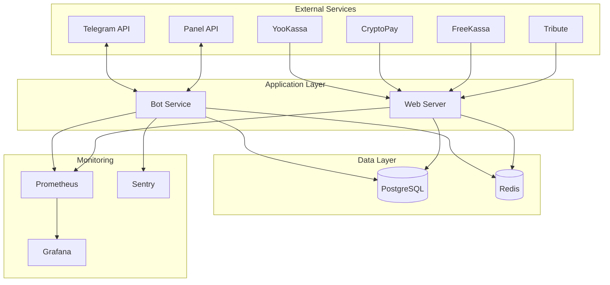

# Руководство по развертыванию 2GETPRO v2

## Обзор

Это руководство описывает различные способы развертывания 2GETPRO v2 в продакшн окружении.

## Содержание

- [Требования к системе](#требования-к-системе)
- [Архитектура развертывания](#архитектура-развертывания)
- [Варианты развертывания](#варианты-развертывания)
- [Быстрый старт](#быстрый-старт)

## Требования к системе

### Минимальные требования

| Компонент | Требование |
|-----------|------------|
| CPU | 2 ядра |
| RAM | 2 GB |
| Диск | 20 GB SSD |
| ОС | Ubuntu 20.04+ / Debian 11+ / CentOS 8+ |
| Python | 3.11+ |
| PostgreSQL | 15+ |
| Redis | 7+ |

### Рекомендуемые требования

| Компонент | Требование |
|-----------|------------|
| CPU | 4 ядра |
| RAM | 4 GB |
| Диск | 50 GB SSD |
| ОС | Ubuntu 22.04 LTS |
| Python | 3.11 |
| PostgreSQL | 15 |
| Redis | 7 |

### Сетевые требования

- **Входящие порты:**
  - `8080` - Webhook endpoints (HTTP/HTTPS)
  - `9090` - Prometheus метрики (опционально)
  - `3000` - Grafana (опционально)

- **Исходящие порты:**
  - `443` - HTTPS для API запросов
  - `5432` - PostgreSQL (если внешняя БД)
  - `6379` - Redis (если внешний)

## Архитектура развертывания

### Компоненты системы



### Схема взаимодействия

1. **Telegram Bot** - Основной сервис бота
2. **Web Server** - Обработка webhook'ов
3. **PostgreSQL** - Основная база данных
4. **Redis** - Кэширование и очереди
5. **Prometheus** - Сбор метрик
6. **Grafana** - Визуализация метрик
7. **Sentry** - Отслеживание ошибок

## Варианты развертывания

### 1. Docker Compose (Рекомендуется)

**Преимущества:**
- ✅ Быстрое развертывание
- ✅ Изолированное окружение
- ✅ Легкое обновление
- ✅ Подходит для малых и средних нагрузок

**Подходит для:**
- Продакшн (до 10k пользователей)
- Staging окружение
- Разработка

📖 [Подробное руководство](./docker.md)

### 2. Kubernetes

**Преимущества:**
- ✅ Высокая доступность
- ✅ Автомасштабирование
- ✅ Оркестрация контейнеров
- ✅ Подходит для больших нагрузок

**Подходит для:**
- Продакшн (10k+ пользователей)
- Высоконагруженные системы
- Мультирегиональное развертывание

📖 [Подробное руководство](./kubernetes.md)

### 3. Bare Metal / VPS

**Преимущества:**
- ✅ Полный контроль
- ✅ Максимальная производительность
- ✅ Гибкая конфигурация

**Подходит для:**
- Специфические требования
- Ограниченные ресурсы
- Обучение и тестирование

📖 Используйте Docker Compose на VPS

## Быстрый старт

### Шаг 1: Подготовка сервера

```bash
# Обновление системы
sudo apt update && sudo apt upgrade -y

# Установка Docker
curl -fsSL https://get.docker.com -o get-docker.sh
sudo sh get-docker.sh

# Установка Docker Compose
sudo apt install docker-compose-plugin -y

# Добавление пользователя в группу docker
sudo usermod -aG docker $USER
newgrp docker
```

### Шаг 2: Клонирование репозитория

```bash
git clone https://github.com/your-repo/2GETPRO_v2.git
cd 2GETPRO_v2
```

### Шаг 3: Конфигурация

```bash
# Копирование примера конфигурации
cp .env.example .env

# Редактирование конфигурации
nano .env
```

**Обязательные параметры:**

```env
# Bot
BOT_TOKEN=your_bot_token_here
ADMIN_IDS=123456789

# Database
POSTGRES_PASSWORD=strong_password_here

# Panel API
PANEL_API_URL=https://your-panel.com
PANEL_API_KEY=your_api_key

# Payment Systems
YOOKASSA_SHOP_ID=your_shop_id
YOOKASSA_SECRET_KEY=your_secret_key

# Webhook
WEBHOOK_BASE_URL=https://your-domain.com
```

### Шаг 4: Запуск

```bash
# Запуск всех сервисов
docker-compose up -d

# Проверка статуса
docker-compose ps

# Просмотр логов
docker-compose logs -f bot
```

### Шаг 5: Проверка

```bash
# Проверка здоровья сервисов
curl http://localhost:8080/health

# Проверка метрик
curl http://localhost:9090/metrics

# Проверка БД
docker-compose exec postgres psql -U postgres -d 2getpro_v2 -c "SELECT COUNT(*) FROM users;"
```

## SSL/TLS сертификаты

### Использование Let's Encrypt

```bash
# Установка Certbot
sudo apt install certbot python3-certbot-nginx -y

# Получение сертификата
sudo certbot --nginx -d your-domain.com

# Автообновление
sudo certbot renew --dry-run
```

### Конфигурация Nginx

```nginx
server {
    listen 443 ssl http2;
    server_name your-domain.com;

    ssl_certificate /etc/letsencrypt/live/your-domain.com/fullchain.pem;
    ssl_certificate_key /etc/letsencrypt/live/your-domain.com/privkey.pem;

    location / {
        proxy_pass http://localhost:8080;
        proxy_set_header Host $host;
        proxy_set_header X-Real-IP $remote_addr;
        proxy_set_header X-Forwarded-For $proxy_add_x_forwarded_for;
        proxy_set_header X-Forwarded-Proto $scheme;
    }
}
```

## Настройка Webhook'ов

### YooKassa

1. Войдите в личный кабинет YooKassa
2. Перейдите в раздел "Настройки" → "Уведомления"
3. Укажите URL: `https://your-domain.com/webhook/yookassa`
4. Выберите события: `payment.succeeded`, `payment.canceled`

### CryptoPay

```bash
# Установка webhook через API
curl -X POST https://pay.crypt.bot/api/setWebhook \
  -H "Crypto-Pay-API-Token: YOUR_TOKEN" \
  -d "url=https://your-domain.com/webhook/cryptopay"
```

### FreeKassa

1. Войдите в панель FreeKassa
2. Настройки → Уведомления
3. URL: `https://your-domain.com/webhook/freekassa`
4. Метод: POST

### Tribute

1. Настройки подписки в Tribute
2. Webhook URL: `https://your-domain.com/webhook/tribute`
3. Секретный ключ: укажите в `TRIBUTE_API_KEY`

### Panel (Remnawave)

1. Настройки панели
2. Webhook URL: `https://your-domain.com/webhook/panel`
3. Секретный ключ: укажите в `PANEL_WEBHOOK_SECRET`

## Мониторинг после развертывания

### Проверка логов

```bash
# Логи бота
docker-compose logs -f bot

# Логи PostgreSQL
docker-compose logs -f postgres

# Логи Redis
docker-compose logs -f redis
```

### Проверка метрик

Откройте в браузере:
- Prometheus: `http://your-server:9090`
- Grafana: `http://your-server:3000` (admin/admin)

### Проверка работы бота

1. Отправьте `/start` боту в Telegram
2. Проверьте создание пользователя в БД
3. Проверьте логи на наличие ошибок

## Резервное копирование

### Автоматическое резервное копирование

```bash
# Создание скрипта бэкапа
cat > backup.sh << 'EOF'
#!/bin/bash
BACKUP_DIR="/backups"
DATE=$(date +%Y%m%d_%H%M%S)

# Бэкап PostgreSQL
docker-compose exec -T postgres pg_dump -U postgres 2getpro_v2 | gzip > "$BACKUP_DIR/db_$DATE.sql.gz"

# Удаление старых бэкапов (старше 7 дней)
find $BACKUP_DIR -name "db_*.sql.gz" -mtime +7 -delete
EOF

chmod +x backup.sh

# Добавление в cron (ежедневно в 3:00)
echo "0 3 * * * /path/to/backup.sh" | crontab -
```

## Обновление

```bash
# Остановка сервисов
docker-compose down

# Обновление кода
git pull origin main

# Обновление образов
docker-compose pull

# Применение миграций
docker-compose run --rm bot alembic upgrade head

# Запуск
docker-compose up -d
```

## Откат версии

```bash
# Остановка
docker-compose down

# Откат кода
git checkout previous-version-tag

# Откат миграций
docker-compose run --rm bot alembic downgrade -1

# Запуск
docker-compose up -d
```

## Troubleshooting

### Бот не запускается

```bash
# Проверка логов
docker-compose logs bot

# Проверка конфигурации
docker-compose config

# Проверка переменных окружения
docker-compose exec bot env | grep BOT_TOKEN
```

### Проблемы с БД

```bash
# Проверка подключения
docker-compose exec bot python -c "from db.database_setup import test_connection; import asyncio; asyncio.run(test_connection())"

# Проверка миграций
docker-compose exec bot alembic current
```

### Webhook не работают

```bash
# Проверка доступности
curl -I https://your-domain.com/webhook/yookassa

# Проверка логов webhook
docker-compose logs bot | grep webhook

# Тест webhook локально
curl -X POST http://localhost:8080/webhook/yookassa \
  -H "Content-Type: application/json" \
  -d '{"test": true}'
```

## Дополнительные ресурсы

- [Docker развертывание](./docker.md)
- [Kubernetes развертывание](./kubernetes.md)
- [Продакшн чеклист](./production.md)
- [Операционное руководство](../operations/README.md)
- [Troubleshooting](../operations/troubleshooting.md)

## Поддержка

При возникновении проблем:

1. Проверьте [Troubleshooting Guide](../operations/troubleshooting.md)
2. Изучите логи: `docker-compose logs -f`
3. Проверьте метрики в Prometheus/Grafana
4. Создайте Issue в репозитории